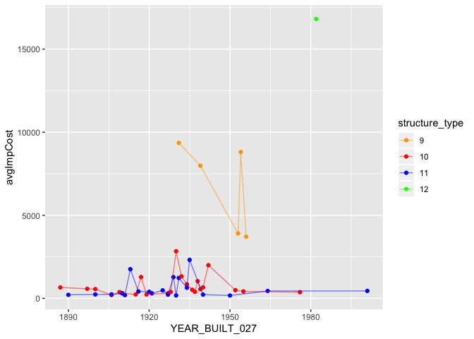

    rm(list = ls())

    #install.packages("data.table")
    library(data.table)
    bridges <- fread("https://www.fhwa.dot.gov/bridge/nbi/2018/delimited/WI18.txt")
    # Bridges data for WI from 2018
    # colnames(bridges)

    library(dplyr)

    ## 
    ## Attaching package: 'dplyr'

    ## The following objects are masked from 'package:data.table':
    ## 
    ##     between, first, last

    ## The following objects are masked from 'package:stats':
    ## 
    ##     filter, lag

    ## The following objects are masked from 'package:base':
    ## 
    ##     intersect, setdiff, setequal, union

    modBridges <- select(bridges, STATE_CODE_001, COUNTY_CODE_003, YEAR_BUILT_027, OPERATING_RATING_064,
                         STRUCTURE_NUMBER_008, STRUCTURE_TYPE_043B, SUFFICIENCY_RATING, TOTAL_IMP_COST_096)
    finalBridges <- modBridges %>%
      filter((STRUCTURE_TYPE_043B == 9 | STRUCTURE_TYPE_043B == 10 |  STRUCTURE_TYPE_043B == 11 |
                STRUCTURE_TYPE_043B == 12) & TOTAL_IMP_COST_096 != 0)

    finalBridges$structure_type <- plyr::mapvalues(finalBridges$STRUCTURE_TYPE_043B, 
                                                   from = c(9, 10, 11, 12), to = c("9","10", "11", "12"))
    # Code found from https://github.com/tidyverse/dplyr/issues/4310
    # Transforms continuous variables into discrete variable

    library(ggplot2)
    finalBridges %>%
      group_by(YEAR_BUILT_027, structure_type) %>%
      summarise(avgImpCost=mean(TOTAL_IMP_COST_096, na.rm=T)) %>%
      ggplot()+
      geom_point(aes(x = YEAR_BUILT_027, y = avgImpCost, col = structure_type)) +
      scale_color_manual(breaks = c("9", "10", "11", "12"), values=c("red", "blue", "green", "orange")) +
      geom_line(aes(x = YEAR_BUILT_027, y = avgImpCost, col = structure_type), alpha=0.5)

    # I wanted to look at the mean implementation cost of four specific structure types by year. Structure 9 is 
    # truss - deck, structure 10 is truss - thru, structure 11 is arch - deck, and structure 12 is arch - thru.
    # I picked these structures as they are my favorite types of bridge structures. There does not seem to be
    # a pattern between structure type and average cost over time. When filtering my data, I excluded any data 
    # points from those specific structures where the implementation cost = 0. That lead to only one data point 
    # for the arch - thru structure. I used ggplot, geom_point, and geom_line to create my plot to show the 
    # relationship between year and average implementation cost.
